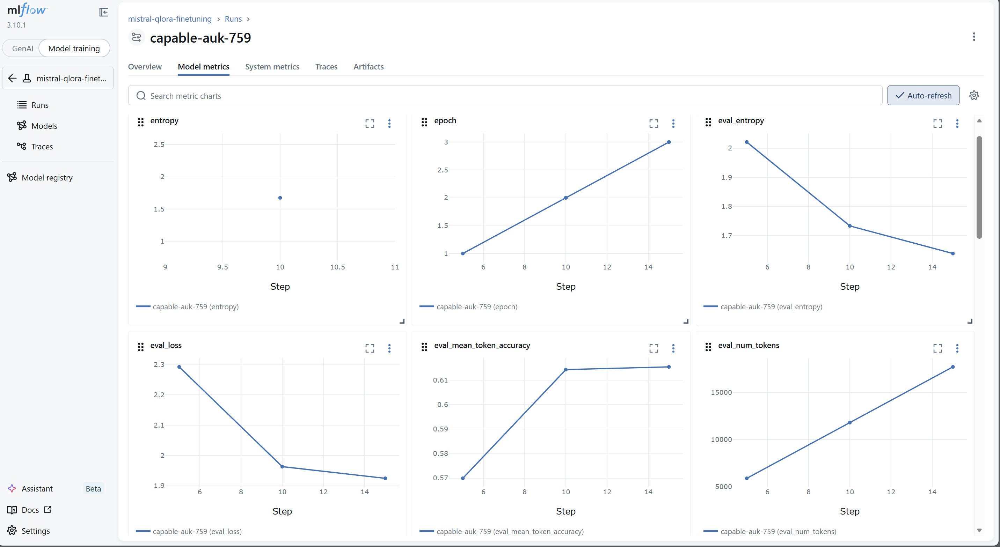
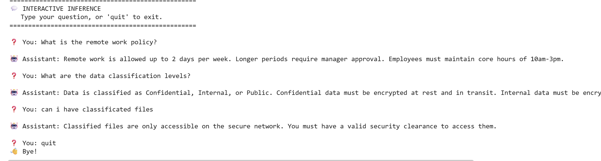
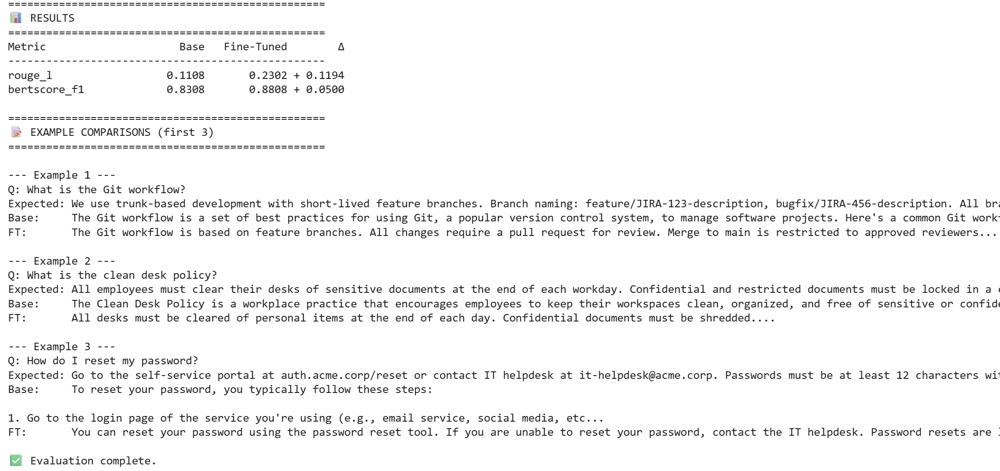

# mistral-finetune

QLoRA fine-tuning of Mistral 7B Instruct on a business Q&A dataset.

[](https://python.org)
[](https://mistral.ai)
[](LICENSE)

## What This Is

A complete fine-tuning pipeline that adapts **Mistral 7B Instruct** to answer company-specific questions using **QLoRA** (4-bit quantized LoRA). The model learns to answer questions about internal policies, procedures, and compliance from a custom Q&A dataset.

## Pipeline

```
raw.jsonl → prepare_data.py → train/val split → train.py (QLoRA) → evaluate.py → inference.py
```

## Quick Start

```bash
# 1. Install
pip install -r requirements.txt

# 2. Prepare data
python src/prepare_data.py

# 3. Train (needs GPU — use Colab free tier)
python src/train.py

# 4. Evaluate
python src/evaluate.py

# 5. Run inference
python src/inference.py
```

## Project Structure

```
mistral-finetune/
├── data/
│   ├── raw.jsonl           ← 99 synthetic corporate Q&A pairs
│   ├── train.jsonl         ← 80% training set
│   ├── val.jsonl           ← 10% validation set
│   └── test.jsonl          ← 10% test set
├── src/
│   ├── prepare_data.py     ← data cleaning and splitting
│   ├── train.py            ← QLoRA fine-tuning
│   ├── evaluate.py         ← ROUGE and BERTScore metrics
│   └── inference.py        ← load adapter and generate
├── notebooks/
│   └── demo.ipynb          ← end-to-end walkthrough
└── outputs/                ← saved LoRA adapter (gitignored)
```

## Dataset

JSONL format with synthetic corporate Q&A:

```json
{"instruction": "What is the remote work policy?", "input": "", "output": "Employees may work remotely up to 3 days per week after completing their 90-day probation period."}
```

Topics covered: remote work, data classification, onboarding, GDPR, IT security, leave policies, expense reporting.

## Training Details

| Parameter | Value |
|-----------|-------|
| Base model | `mistralai/Mistral-7B-Instruct-v0.3` |
| Method | QLoRA (4-bit NF4) |
| LoRA rank | 16 |
| LoRA alpha | 32 |
| Target modules | `q_proj`, `k_proj`, `v_proj`, `o_proj` |
| Epochs | 3 |
| Learning rate | 2e-4 |
| Batch size | 4 (effective 16 with gradient accumulation) |
| Hardware | Google Colab T4 (free tier) |
| Training time | ~30 min |

## MLOps & Experiment Tracking

To ensure reproducibility and professional tracking of hyperparameters and metrics, the training loop is integrated with **MLflow**. 



*The dashboard above captures the model's convergence across epochs. The steady decline in `eval_loss` alongside the increase in `eval_mean_token_accuracy` confirms the model is successfully learning the corporate domain without diverging, despite the small dataset.*

## Results

| Metric | Base Model | Fine-Tuned | Δ |
|--------|-----------|------------|---|
| ROUGE-L | 0.1108 | 0.2302 | **+ 0.1194** |
| BERTScore F1 | 0.8308 | 0.8808 | **+ 0.0500** |

### Qualitative Analysis

The quantitative improvements reflect a profound shift in the model's tone and domain alignment:



*   **Base Model (Wikipedia Style)**: Answers generally. E.g., for "What is the clean desk policy?", it defines what a clean desk policy is in the general world, outputting generic workplace advice.
*   **Fine-Tuned Model (Corporate Style)**: Adopts an authoritative, internal tone. For the same question, it answers with the specific company directive: *"All desks must be cleared of personal items at the end of each day. Confidential documents must be shredded."*



Despite a very small dataset (~80 examples), the model successfully overrides its broad conversational training to align with a specific, internal corporate reality.

## Training Infrastructure (Google Colab)

A key constraint of this project was validating a fine-tuning pipeline without access to high-end enterprise hardware.

*   **Hardware constraint**: Trained on a Google Colab instance using a single **NVIDIA T4 GPU (15GB VRAM)**.
*   **Memory optimization**: A full 7B model requires ~14GB in FP16 for inference alone, making full fine-tuning impossible on a T4. By applying **4-bit NF4 quantization (bitsandbytes)** and only training the **LoRA adapters** (0.19% of total parameters), VRAM usage was kept below 14GB during training.
*   **Cost & Sovereign intent**: This workflow proves that highly customized, data-sovereign enterprise assistants can be bootstrapped quickly and cheaply on commodity hardware before scaling to production instances (like OVHcloud or OUTSCALE).

## Model Choice

**Mistral 7B Instruct v0.3** — French open-weight model (Apache 2.0), fits on a free Colab T4 with QLoRA, strong instruction following out of the box.

## License

Apache 2.0
